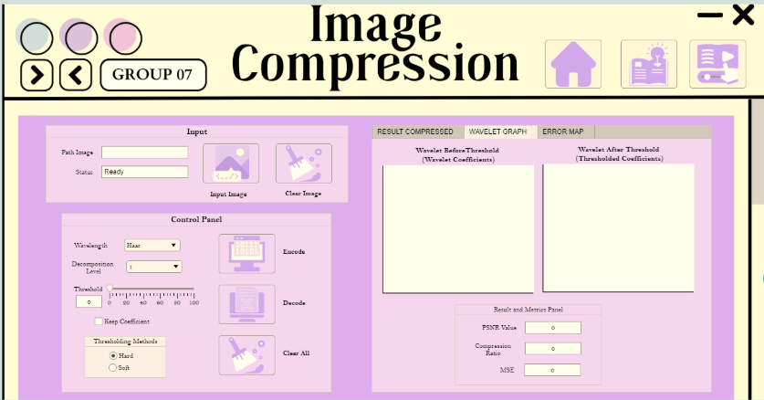
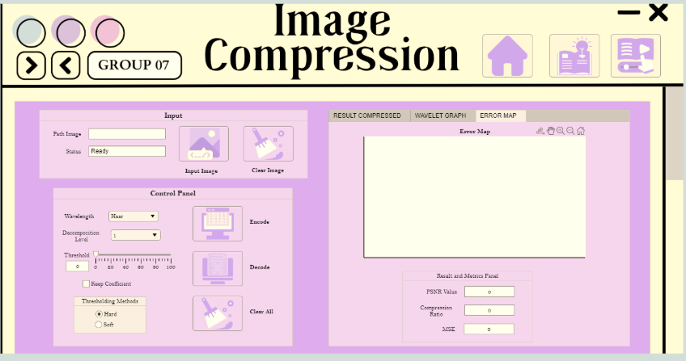
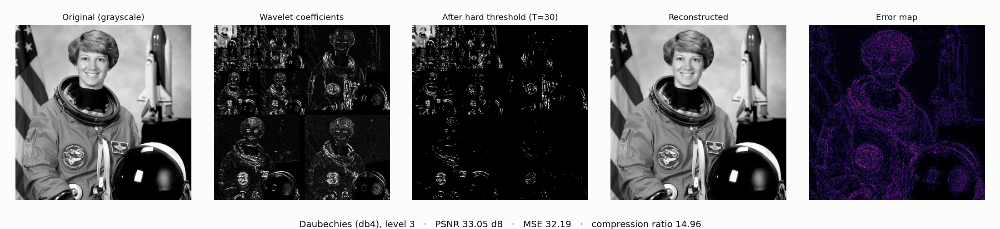
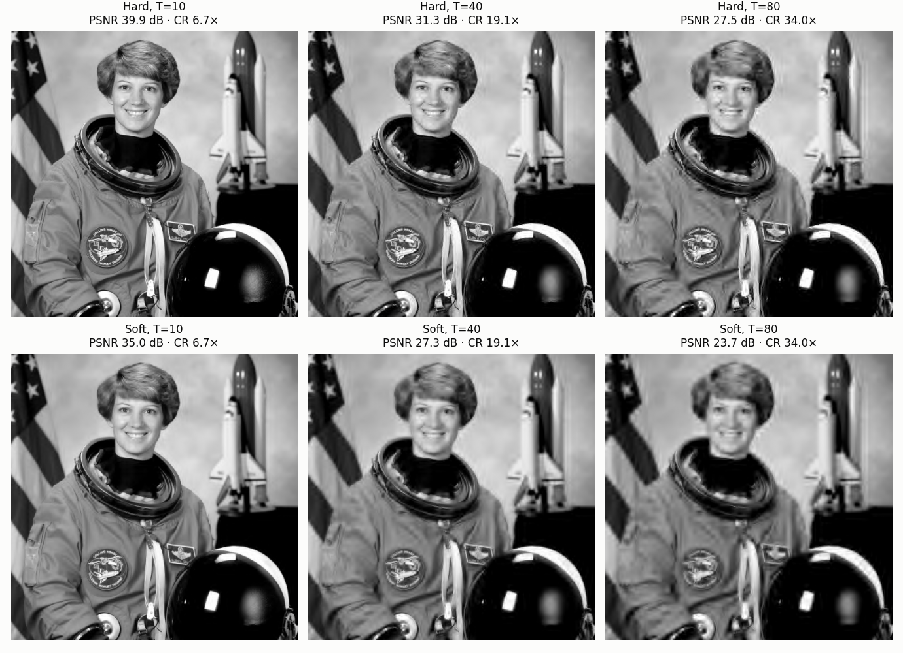
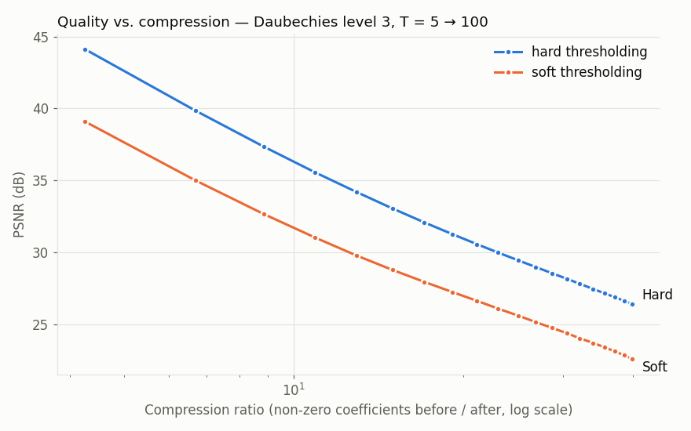

# Wavelet Image Compression: Simulation & Visualization

A MATLAB App Designer GUI that shows how **Discrete Wavelet Transform (DWT)** image compression works step by step. You load an image, pick a wavelet and decomposition level, threshold the coefficients, and see the wavelet sub-bands, the reconstructed image, the error map, and quality metrics (PSNR, MSE, compression ratio).

The repo also includes a **Python port of the same algorithm** (PyWavelets). It generates the figures below, so the results can be reproduced without a MATLAB license.

<p>
  
  
</p>

<sub>The MATLAB App Designer GUI: input panel, control panel (wavelet, level, threshold, hard/soft), result tabs, and metrics panel.</sub>



<sub>Figures generated with <code>python/demo.py</code> on a public-domain NASA photo, using the same algorithm as the MATLAB app.</sub>

## Features (MATLAB app)

- **Input:** any JPG/PNG/BMP/TIFF image, converted to grayscale
- **5 wavelet families:** Haar (`haar`), Daubechies (`db4`), Symlets (`sym4`), Coiflets (`coif2`), Biorthogonal (`bior2.2`)
- **Decomposition level** 1–5
- **Threshold** 0–100 via slider, with **hard** or **soft** thresholding
- **Encode:** shows the wavelet coefficients before and after thresholding
- **Decode:** inverse DWT gives the compressed image and an **error map**
- **Metrics:** PSNR, MSE, and compression ratio

## How It Works

```
image ─► grayscale ─► 2-D DWT (wavedec2) ─► threshold coefficients (wthresh) ─► inverse DWT (waverec2) ─► compressed image
                                                     │                                                      │
                                     compression ratio = non-zero coeffs before / after        MSE, PSNR = 10·log10(255² / MSE)
```

Most of an image's energy sits in a few large wavelet coefficients. Thresholding sets the small ones to zero, so there are fewer values to store (compression) while most of the visual quality is kept.

- **Hard thresholding** keeps coefficients above T unchanged and zeroes the rest.
- **Soft thresholding** zeroes coefficients below T and also shrinks the remaining ones by T.

## Results

**Hard vs. soft thresholding** (Daubechies db4, level 3):





At the same compression ratio, hard thresholding keeps roughly 4–5 dB more PSNR than soft thresholding. Soft thresholding shrinks every surviving coefficient, which smooths the image (visible at T=80) and lowers PSNR.

**Wavelet comparison** (level 3, T = 30, hard thresholding, 512×512 image):

| Wavelet | MATLAB name | PSNR (dB) | MSE | Compression ratio |
|---|---|---|---|---|
| Haar | `haar` | 31.79 | 43.09 | 11.36× |
| Daubechies | `db4` | 33.05 | 32.19 | 14.96× |
| Symlets | `sym4` | 33.15 | 31.45 | 15.55× |
| Coiflets | `coif2` | 33.19 | 31.21 | 15.32× |
| Biorthogonal | `bior2.2` | **33.33** | **30.22** | 15.12× |

Smoother wavelets (db4, sym4, coif2, bior2.2) beat Haar on both quality and compression. Haar's blocky basis functions produce more visible artifacts at the same threshold.

## Run It

### MATLAB app

Requirements: MATLAB R2021b or newer, plus the **Wavelet Toolbox** and **Image Processing Toolbox**.

1. Add the `matlab/` folder to the MATLAB path. The button icons must sit next to `simsim.mlapp`.
2. Open `simsim.mlapp` in App Designer and click **Run**.
3. Click **Input Image** and choose an image.
4. Pick a wavelet, decomposition level, threshold, and hard/soft method.
5. Click **Encode** to see the coefficients, then **Decode** to see the compressed image, error map, and metrics.

`matlab/simsim_source.m` is a read-only text export of the app's code, so it can be read on GitHub (`.mlapp` files are binary).

### Python port

```bash
pip install -r requirements.txt
python python/demo.py                  # sample image, regenerates images/
python python/demo.py path/to/image.jpg  # your own image
```

```python
# run from the python/ folder
from skimage import io
from wavelet_compression import compress

r = compress(io.imread("photo.jpg"), wavelet="Daubechies", level=3, threshold=30, method="hard")
print(r.psnr, r.mse, r.compression_ratio)
```

## Project Structure

```
├── matlab/
│   ├── simsim.mlapp            # App Designer GUI
│   ├── simsim_source.m         # readable export of the app code
│   └── *.png                   # button icons and background used by the GUI
├── python/
│   ├── wavelet_compression.py  # same algorithm with PyWavelets
│   └── demo.py                 # generates the README figures and table
├── images/                     # README figures
└── requirements.txt
```

## Tech Stack

MATLAB App Designer · Wavelet Toolbox · Image Processing Toolbox · Python · PyWavelets · NumPy · Matplotlib

---

<sub>Group course project (Kelompok 7). Sample image: astronaut Eileen Collins, NASA, public domain (via scikit-image).</sub>
